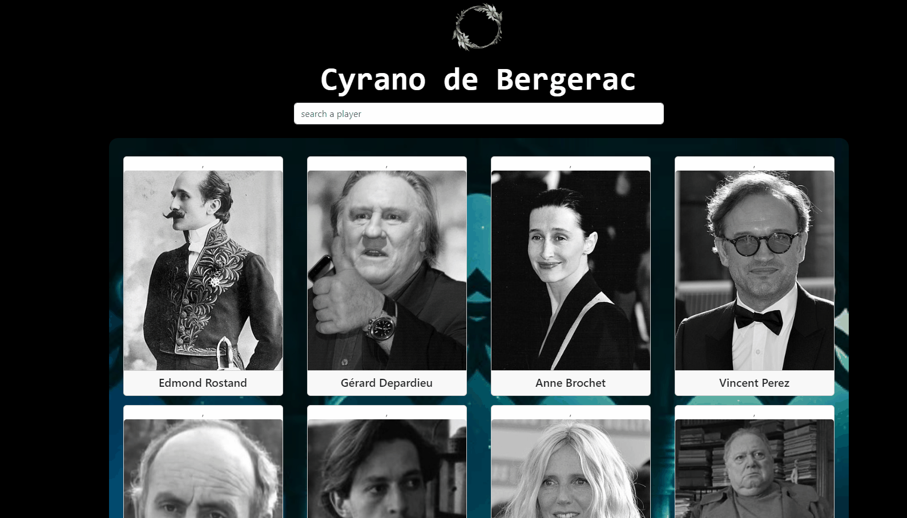

# Cyrano de Bergerac
This project is a website created using React and React-icons. You can use the search feature to perform searches and click on the cards to see information about the players.
## Screenshots
 

[Cyrano de Bergerac Live Page](https://cyrano-de-bergerac-esma.netlify.app/)

## Tech/framework used
<b>Built with</b>  
 

## Description
In the project directory, you can run:
### `npm start`
Runs the app in the development mode.\
Open [http://localhost:3000](http://localhost:3000) to view it in your browser.

 
